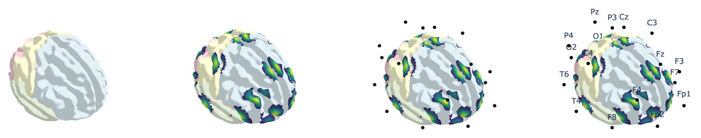

# MCRV
MNI152-Cortex-ROI-Visualization

Images created through the python codes:

- The NMI152 standarized coordinates were used.
- The EEG channels coordinates determined in Okamoto M, et al., 2004 (table 2) were used. The summarized `csv` table is available [here](data/0_Okamoto_M_2004_table2_MNI_coordinates.csv).
- The lobe color were determined based on Harvard-Oxford atlas and manual annotations of corresponding cortical lobes (see the [csv table](data/0_Harvard_Oxford_Brodmann_Lobe.csv)).
- 99% of codes were generated by ChatGPT o3
- The 3D image can be available as a [html file](data/4_result.html).